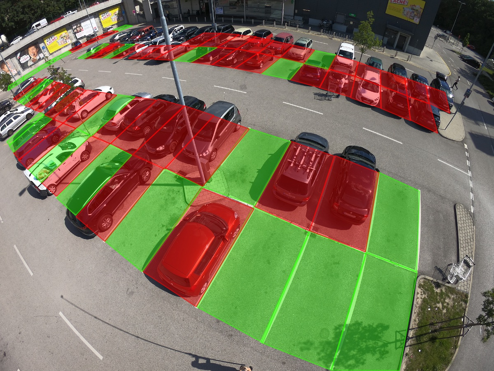

# Image-Based Parking Space Occupancy Classification

Official repository for the [Image-Based Parking Space Occupancy Classification: Dataset and Baseline](https://arxiv.org/abs/2107.12207) paper.

We introduce a new dataset for image-based parking space occupancy classification and propose a simple baseline model which achieves 98% accuracy on unseen parking lots.

In this repository, we provide:
- code to reproduce all of our results
- download links for the [dataset](https://storage.googleapis.com/pd-datasets/rois_gopro.zip), [training logs](https://storage.googleapis.com/pd-datasets/paper_training_output.zip), and [model weights](https://storage.googleapis.com/pd-models/RCNN_128_square_gopro.pt)
- Colab notebooks to [explore the dataset and models](https://colab.research.google.com/github/martin-marek/parking-space-occupancy/blob/main/notebooks/model_playground.ipynb), [train a model](https://colab.research.google.com/github/martin-marek/parking-space-occupancy/blob/main/notebooks/train.ipynb), and [plot the training logs](https://colab.research.google.com/github/martin-marek/parking-space-occupancy/blob/main/notebooks/train_log_analysis.ipynb)

# Dataset

The dataset (called *Action-Camera Parking Dataset*) contains 293 images captured at a roughly 10-meter height using a GoPro Hero 6 camera. Here is a sample from the dataset:



# Inference

Here's a minimal example to run inference on a trained model. For more, please see the [demo notebook](https://colab.research.google.com/github/martin-marek/parking-space-occupancy/blob/main/notebooks/model_playground.ipynb).

```python
import torch, os, requests
from models.rcnn import RCNN
from utils import transforms

# create model
model = RCNN()

# load model weights
weights_path = 'weights.pt'
if not os.path.exists(weights_path):
    r = requests.get('https://storage.googleapis.com/pd-models/RCNN_128_square_gopro.pt')  
    with open(weights_path, 'wb') as f:
        f.write(r.content)
model.load_state_dict(torch.load(weights_path, map_location='cpu'))

# inference
image = torch.zeros([3, 1000, 1000])
parking_space_coordinates = torch.zeros([10, 4, 2])
image = transforms.preprocess(image)
class_logits = model(image, parking_space_coordinates)
class_scores = class_logits.softmax(1)[:, 1]
```

# Training

To reproduce our full results from the paper, please run the [train_all_models](https://github.com/martin-marek/parking-space-occupancy/blob/main/train_all_models.py) script locally. To train just a single model, please use the provided [Colab notebook](https://colab.research.google.com/github/martin-marek/parking-space-occupancy/blob/main/notebooks/train.ipynb) – Google Colab is sufficient for this.

# Citation

```bibtex
@misc{marek2021imagebased,
      title={Image-Based Parking Space Occupancy Classification: Dataset and Baseline}, 
      author={Martin Marek},
      year={2021},
      eprint={2107.12207},
      archivePrefix={arXiv},
      primaryClass={cs.CV}
}
```
